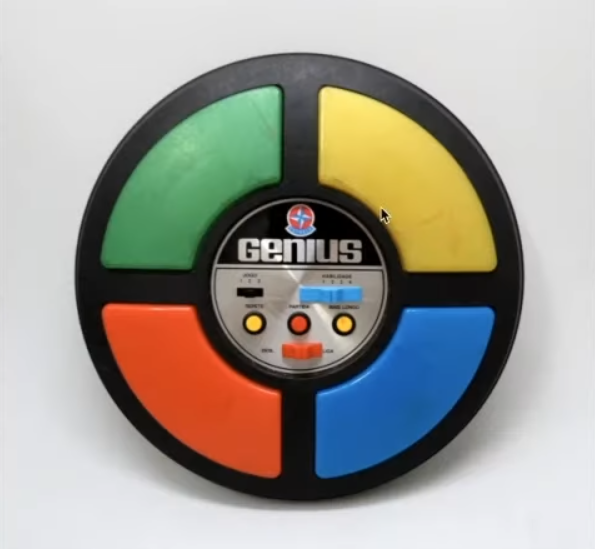
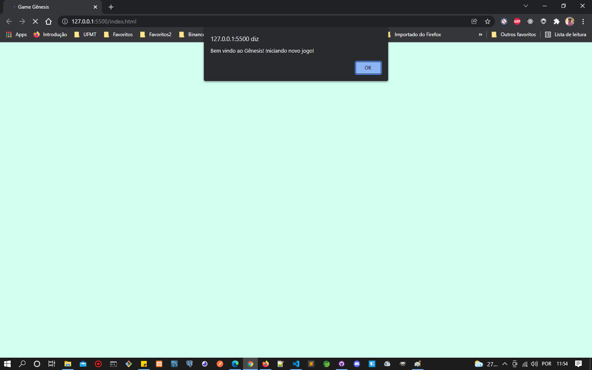
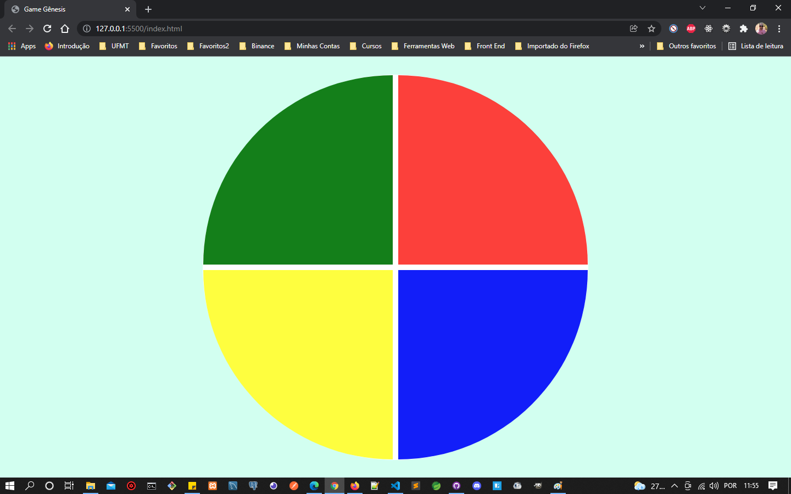
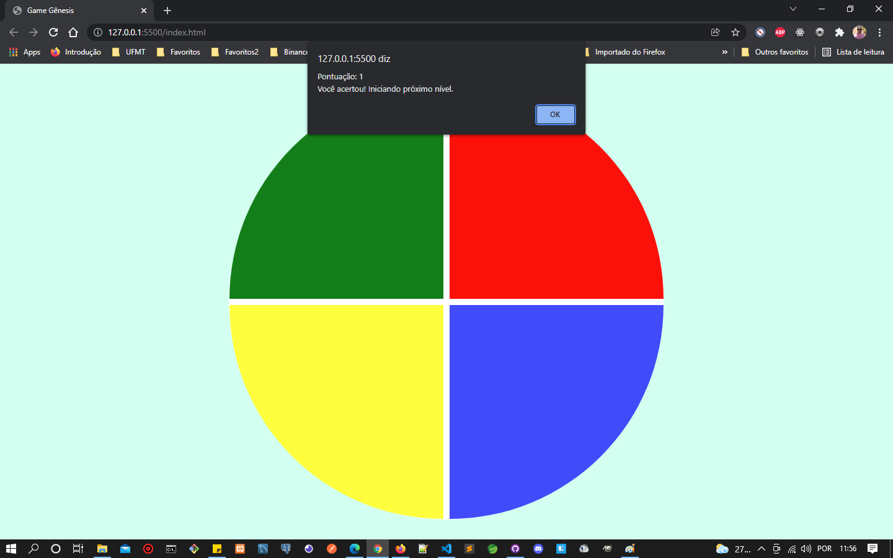
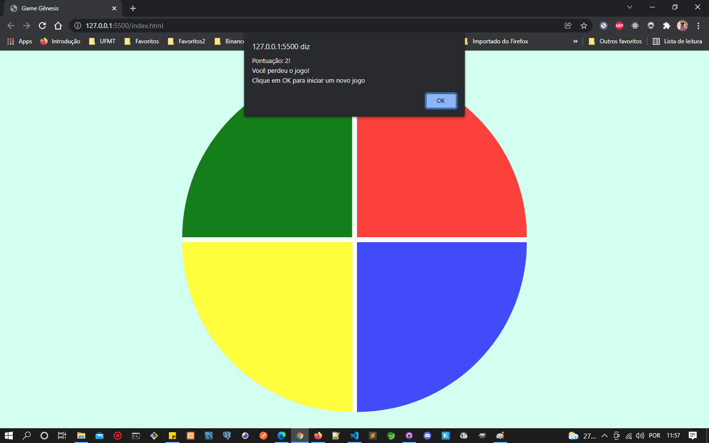

# Jogo de memória estilo Genius

## Projeto

Nesse projeto, foi desenvolvido um jogo que simula o Game Genius. Foi criado utilizando apenas HTML, CSS e Javascript de forma introdutória, sendo o principal conceito, CSS Grid, manipulação de Array e Arrow Functions.

## Jogo Genius

Abaixo podemos ver o jogo Genius em que este projeto foi baseado.
As cores acendem e apangam, o jogador precisa selecionar a ordem correta em que as cores foram apresentadas.

<p align="center">
    
</p>
<br>

## Prévia vizualização do jogo

Tela inicial do Jogo.

<p align="center">
    
</p>
<br>

Inicio do jogo para selecionar a ordem das cores que foram apresentadas.

<p align="center">
    
</p>
<br>

Pontuação quando seleciona as cores na ordem certa.

<p align="center">
    
</p>
<br>

Game Over!
Mostra sua pontuação.

<p align="center">
    
</p>
<br>

## 🚀 Tecnologias

Esse projeto foi desenvolvido com as seguintes tecnologias:

-   [HTML5](https://developer.mozilla.org/pt-BR/docs/Web/HTML)
-   [CSS3](https://developer.mozilla.org/pt-BR/docs/Web/CSS)
-   [JavaScript](https://developer.mozilla.org/pt-BR/docs/Web/JavaScript)

<br>

## Executar Aplicação

## 🔥 Executando Localmente a Aplicação

Caso você deseja executar o projeto na sua máquina local, basta seguir os passos abaixo:

### 🌀 Começando...

Para começar, você deve simplesmente clonar o repositório do projeto na sua máquina.
<br>
Exemplo:

```
"C:\Users\NomeDoComputador\Documents\clonedoprojeto"
```

#### 💨 Executando a Aplicação

Bom, agora **(dentro da pasta `genius-style-memory-game` do projeto clonado)**, clique duas vezes seguidas no arquivo index.html.
<br>
Pronto! dessa forma o projeto estará rodando localmente em sua maquina, será aberto automaticamento seu navegador padrão e iniciará o jogo.

<br>

## 🚩 Tenho Dúvidas... O que fazer?

Caso tenham dúvidas sobre o código do projeto, sintam-se a vontade em abrir uma **[ISSUE AQUI](https://github.com/Wanderson-A-Timoteo/genius-style-memory-game/issues)**. Assim que possível, estarei respondendo a todas as dúvidas que tiverem!

<br>

## Licença

Esse projeto está sob a licença MIT. Veja o arquivo [LICENSE](LICENSE) para mais detalhes.

<br>

## Autor:

Feito com ♥ by

-   [**Wanderson A. Timóteo**](https://wanderson.tk)

<br>

## Agradecimentos:

<h1 align="center">
    
</h1>

-   Projeto desenvolvido durante as aulas na plataforma [Digital Innovation One](https://web.dio.me/sign-in).

-   Agradecimento a [Gabriela Pinheiro](https://github.com/SpruceGabriela) por compartilhar seu conhecimento com a comunidade dev.
